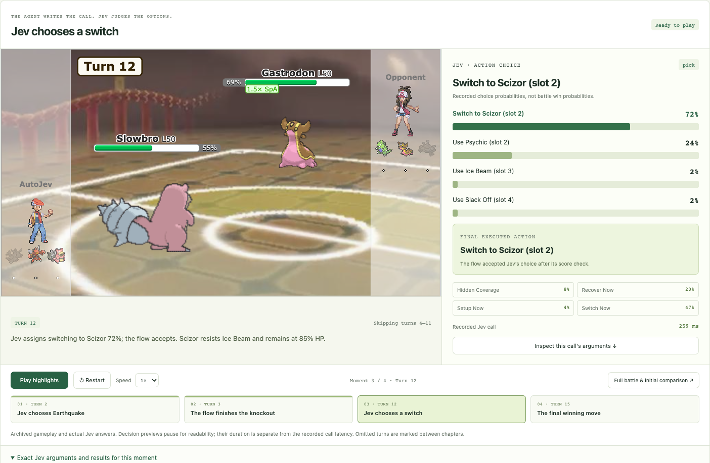
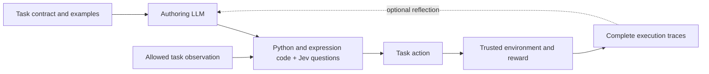

# JevHarness

**Let an LLM write a task-specific harness for Jev. Run it, inspect its decisions, and optionally improve it using rewards and complete execution traces.**

A harness turns task observations into useful features, constructs Jev questions and criteria, and combines the structured answers into actions. The authoring LLM can change the code, questions, graph, and memory. Once the harness is fixed, execution uses that code and its Jev calls; it does not need the authoring LLM on every decision.

[Explore the live demo](https://jev-harness.tianyuchen99.chatgpt.site/?autoplay=1#comparison) · [Build a task](docs/task-authoring.md) · [Actual Jev call](docs/jev-example.md) · [Install the agent skill](skills/jev-harness/SKILL.md)



## Start with the example

The Pokémon example includes an actual archived run, the selected harness, a browsable evolution tree, complete decision records, and replay highlights synchronized with their Jev answers. Browsing the archive makes no model requests and starts no games.

```bash
git clone https://github.com/TianyuCodings/JevHarness.git
cd JevHarness
node website/build.mjs
node website/preview.mjs --port 8768
```

Open [localhost:8768](http://localhost:8768). The viewer needs Node.js and a modern browser; battle animations download assets from the official Pokémon Showdown renderer. The archived battle log stays in the browser and is not uploaded to a replay server. See [website setup](website/README.md) for deployment and archive verification.

The featured harness improved from **3/12 to 9/12 wins on the same Eval set** during one recorded search. Eval was used for selection. This is an example result, not an independent estimate of performance on unseen games. The page shows Train/Eval only, distinguishes sampled training coverage, and includes rejected proposals.

## Make a real Jev call

Install the Python framework:

```bash
uv sync --locked --extra dev
```

This snippet sends the **exact state and questions from turn 12** of the featured game. Set `AI_GATEWAY_API_KEY` in your environment first. It makes a new request, so the response can differ from the archive.

```python
import json
from pathlib import Path
from auto_jev.providers import JevClient

record = json.loads(Path("docs/examples/pokemon-turn12-jev.json").read_text())
client = JevClient(transport="vercel")
response = client.judge(**record["request"])
print(response["answers"]["action"])
```

The recorded answer selected `switch:2` (Scizor) with probability `0.72`; the final code accepted that choice. These are action-choice probabilities, not battle win probabilities.

To inspect the recorded answer without credentials or a request:

```bash
python3 docs/examples/jev_call.py
```

Use `uv run python docs/examples/jev_call.py --live` to explicitly send it again. [The example](docs/jev-example.md) includes the original instructions, criteria, full state, normalized answer, timing, and provenance. The [selected pipeline JSON](examples/pokemon/sample/selected-pipeline.json) contains all four execution nodes and their complete source.

## How it works



The task adapter owns observations, legal actions, side effects, and scoring. The harness owns feature construction, Jev judgments, and decision logic. That boundary makes it possible to change the harness without letting it rewrite its own reward or read hidden task state.

- **Author once, then execute.** Validate a `PipelineSpec` and run it through `PipelineRuntime`. Reflection is optional.
- **Compose judgments.** Jev supports `choice`, `score`, and `noul` answers. Multiple questions can share one request; independent graph nodes can run concurrently.
- **Improve from evidence.** The optional GEPA integration selects parents from an instance frontier, compares parent and proposal on the same training batch, and fully evaluates accepted proposals on Eval. It records actual ancestry, including rejected proposals.
- **Keep the whole trace.** Reflection includes each selected episode's complete decisions, observations, node inputs and outputs, Jev questions and answers, memory, and failures. Lossless deduplication reduces repetition; an input that exceeds the configured byte cap is archived and rejected without truncation.
- **Freeze the selected harness.** Frozen artifacts bind the specification, runtime, evaluator, and declared task resources. They still need Jev if they contain Jev nodes. A hosted model alias does not pin future provider behavior; stored responses and fresh calls have different reproducibility guarantees.


## Build your own task

Start with the [task authoring guide](docs/task-authoring.md) or install the [JevHarness agent skill](skills/jev-harness/SKILL.md):

```bash
python3 scripts/install-skill.py --target both --scope project
```

This installs the skill into `.agents/skills/jev-harness` for Codex and `.claude/skills/jev-harness` for Claude Code. Use `--scope user` to install for your other projects, or `--target codex` / `--target claude` to select one agent. Existing different skills are never overwritten. See the [installation guide](skills/jev-harness/references/installation.md).

Invoke `$jev-harness` in Codex or `/jev-harness` in Claude Code. The skill first asks for enough information about your task, observations, legal actions, examples, success criteria, environment, and experiment resources. It then writes the harness; you do not need to handwrite Jev instructions or criteria. If trustworthy reward feedback is available, ask it to add evaluation and reflection optimization.

The reusable interfaces are Python APIs: `PipelineRuntime`, `JevClient`, `run_evolution`, `build_task_contract`, `freeze_run`, and `evaluate_frozen`. The existing `auto-jev` CLI remains oriented toward the earlier trading example; it is not a generic task loader. Pokémon has its own [runner and setup](examples/pokemon/README.md).

## Runtime and credentials

The Python project requires Python 3.11+. Functional Python nodes currently require a supported macOS native sandbox; unavailable isolation fails closed. Version 2 expression/Jev flows do not launch those Python workers. The archived website needs neither the sandbox nor a game engine.

| Purpose | Configuration |
| --- | --- |
| Jev through Vercel AI Gateway | `JevClient(transport="vercel")`; `AI_GATEWAY_API_KEY` |
| Jev through TypeSafe directly | `JevClient(transport="typesafe")`; `TYPESAFE_API_KEY` |
| Optional authoring/reflection | `Proposer` configured for a local Claude CLI, OpenAI, Azure, or Anthropic endpoint |
| Archived website and recorded-call inspection | No model credentials |

The package and imports retain the names `auto-jev` and `auto_jev`. Provider adapters being implemented does not establish that every model or endpoint is available to your account. Keep credentials in environment variables or a local ignored `.env`; never include them in task observations or artifacts.

## Repository map

| Path | Purpose |
| --- | --- |
| [`auto_jev/`](auto_jev/) | Specification validation, parallel runtime, Jev transports, reflection, GEPA, storage, and freezing |
| [`examples/pokemon/`](examples/pokemon/) | Trusted battle adapter, seeded local engine bridge, harnesses, and interactive presentation |
| [`examples/pokemon/sample/`](examples/pokemon/sample/) | Selected harness and the curated website archive, with provenance |
| [`docs/`](docs/) | Task authoring, an actual Jev call, and website screenshots |
| [`skills/jev-harness/`](skills/jev-harness/) | Instructions for a coding agent authoring a task-specific harness |
| [`website/`](website/) | Read-only demonstration and its deployment adapter |

See [TypeSafe's judgment primitives](https://docs.typesafe.ai/primitives) and [GEPA's candidate selection documentation](https://gepa-ai.github.io/gepa/guides/candidate-selection/) for the underlying interfaces and optimization method.
