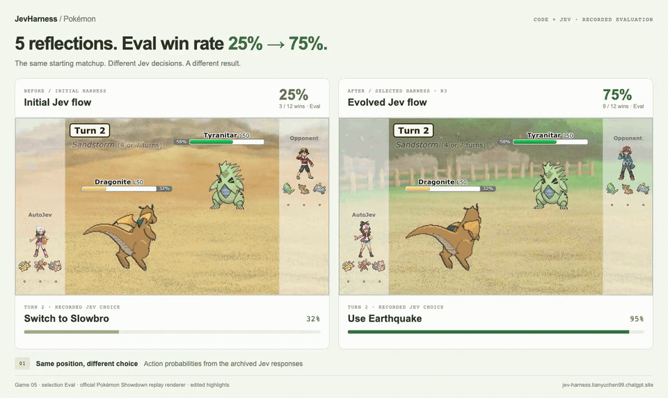
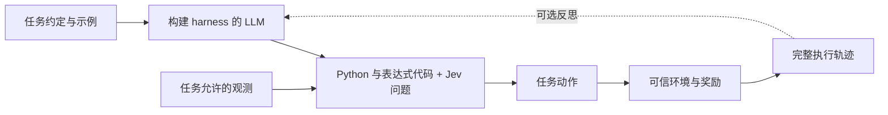
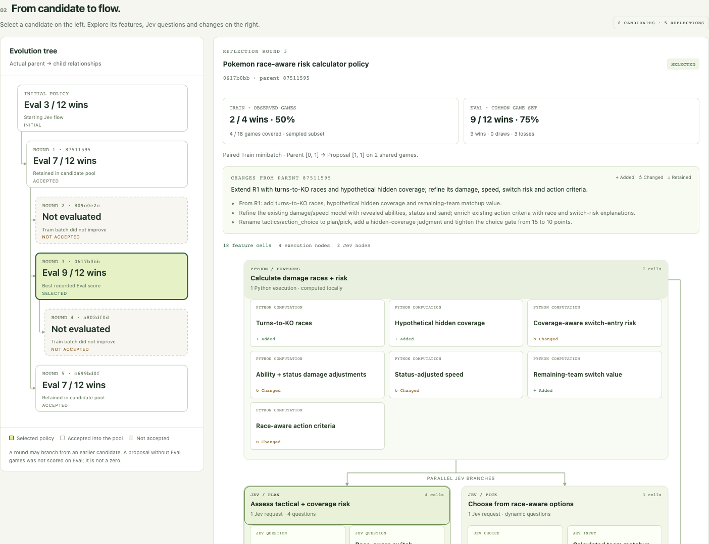

# JevHarness

**[English](README.md) | 简体中文**

**让 LLM 为 Jev 编写面向具体任务的 harness（任务执行框架）。运行它、查看它的决策，并按需利用奖励和完整执行轨迹进行改进。**

Harness 将任务观测转化为有用的特征，构建 Jev 问题与判定标准，再将结构化回答组合为动作。负责构建的 LLM 可以修改代码、问题、流程图与记忆。Harness 固定后，执行依靠这些代码及其 Jev 调用，无需让构建它的 LLM 参与每次决策。

**开发时深入推理，固化策略，让 Jev 快速完成模糊决策。**

强大的 LLM 具备广泛的知识与深入推理能力，但每次行动都重新生成推理，会增加延迟和成本。Jev 能快速完成轻量判断，但处理开放式推理的能力较为有限。JevHarness 将两者结合：让 LLM 编写面向具体任务的 harness，再按需利用奖励和完整执行轨迹持续改进。

Harness 将 LLM 的推理策略固化为明确的代码、特征、状态、指令、判定标准和控制流程。代码负责计算有用的事实，Jev 根据这些事实作出**依赖上下文的模糊判断**。开发期间，负责构建的 LLM 可以修改 harness 及其记忆。选定并冻结 harness 后，代码与 Jev 调用即可独立执行，无需让构建它的 LLM 参与每一次决策。

**宝可梦实验结果：经过 5 轮反思，选中的 harness 将 Eval 胜率从 25%（3/12）提高至 75%（9/12）。** 搜索最终保留第 3 轮的候选作为最佳 harness；Eval 用于候选选择。

[打开交互演示](https://jev-harness.tianyuchen99.chatgpt.site/?autoplay=1#paired-archive) · [工作原理](#工作原理) · [延迟](#延迟) · [安装与使用技能](#在-claude-code-中安装)

[](docs/media/pokemon-comparison.mp4)

**初始版与进化版对比：** 两个 harness 挑战同一个评估场景。初始版落败，选中的进化版获胜。**视频为剪辑片段：先展示第 2 回合决策，再跳转到各自的对战结局。** [观看 MP4](docs/media/pokemon-comparison.mp4)，或[打开完整对战存档](https://jev-harness.tianyuchen99.chatgpt.site/?autoplay=1#paired-archive)。

## 在 Claude Code 中安装

在 Claude Code 会话中依次运行：

```text
/plugin marketplace add https://github.com/TianyuCodings/JevHarness.git
/plugin install jev-harness@jevharness
/reload-plugins
```

技能调用示例、Codex 安装与手动安装方式见[构建自己的任务](#构建自己的任务)。

## 从示例开始

宝可梦示例包含一次真实实验的存档、选中的 harness、可浏览的进化树、完整决策记录，以及与 Jev 回答同步的关键回放。浏览存档不会请求模型，也不会启动新的对局。

```bash
git clone https://github.com/TianyuCodings/JevHarness.git
cd JevHarness
node website/build.mjs
node website/preview.mjs --port 8768
```

打开 [localhost:8768](http://localhost:8768)。查看器需要 Node.js 和现代浏览器；对战动画会从官方 Pokémon Showdown 渲染器下载素材。存档中的对战日志保留在浏览器内，不会上传至回放服务器。部署和存档验证方法见[网站配置说明](website/README.md)。

这里的提升是用于候选选择的 Eval 集上的示例结果，并非对未见对局表现的独立估计。页面仅展示 Train/Eval，区分采样训练的覆盖范围，并保留被拒绝的提案。

## 延迟

在存档中的 Eval 实验里，选中的宝可梦 harness 的**完整决策延迟中位数为 568 ms**，**单次 Jev 请求延迟中位数为 269 ms**。

| 测量项 | 中位数 | P95 | 样本量 |
| --- | ---: | ---: | ---: |
| 初始 harness：完整决策 | 678 ms | 1,495 ms | 238 次决策 |
| 选中 harness：完整决策 | **568 ms** | **657 ms** | 113 次决策 |
| 选中 harness：单次 Jev 请求 | **269 ms** | **348 ms** | 226 次请求 |

这些成功完成的计时记录来自每个 harness 的 12 场 Eval 对局；纳入统计的每次 Jev 调用均明确标记为未命中本地响应缓存。完整决策时间包括特征计算、并行 Jev 调用和最终动作选择；Jev 请求时间包含客户端与网络开销。并行请求的耗时相互重叠，不能直接相加。对战模拟和构建、反思所用时间均不计入决策延迟。

[存档测量数据与统计方法](https://jev-harness.tianyuchen99.chatgpt.site/api/latency?split=eval)包含缓存排除规则和各节点统计。这些数据不是受控的速度对比实验；本实验没有测试让 LLM 参与每次运行时决策的延迟。

## 工作原理



任务适配器管理观测、合法动作、副作用与评分。Harness 管理特征构建、Jev 判断与决策逻辑。这一边界允许修改 harness，同时避免它改写自己的奖励或读取任务的隐藏状态。

- **构建后即可执行。** 验证 `PipelineSpec`，再通过 `PipelineRuntime` 运行。反思优化是可选步骤。
- **组合多个判断。** Jev 支持 `choice`、`score` 和 `noul` 类型的回答。多个问题可以共享一次请求；流程图中相互独立的节点可以并行运行。
- **根据证据改进。** 可选的 GEPA 集成从逐实例前沿（instance frontier）中选择父候选，在相同训练批次上比较父候选与新提案，并对接受的提案执行完整 Eval。系统记录真实的候选谱系，包括被拒绝的提案。
- **保留完整轨迹。** 反思输入包含每个选中对局的完整决策、观测、节点输入与输出、Jev 问题与回答、记忆和失败记录。无损去重用于减少重复；超过配置字节上限的输入会被存档并拒绝处理，不会截断后继续。
- **冻结选中的 harness。** 冻结产物将规格、运行时、评估器与声明的任务资源绑定在一起。只要包含 Jev 节点，执行时仍需要 Jev。托管模型别名无法锁定提供方未来的行为；使用存储响应与发起新调用，可复现性的保证不同。

Harness 负责构建 Jev 输入：任务相关的 `state`、具名的 `questions`、回答 `type`，以及用于判断可选动作的 `instructions` 和 `criteria`。下面展示**真实记录的第 12 回合请求与回答**，仅为便于阅读而缩减了状态和响应元数据。所有展示的值均保持不变；**JSON 字段名和字符串值保留实际调用时的英文原文**。[完整 JSON](docs/examples/pokemon-turn12-jev.json)包含完整状态、回答、计时与来源信息。

```json
{
  "request": {
    "model": "typesafe-ai/jev",
    "state": {
      "position": {
        "turn": 12,
        "our_active": {
          "species": "Slowbro",
          "hp_percent": 54
        },
        "opponent_active": {
          "species": "Gastrodon",
          "hp_percent": 69
        },
        "race": {
          "our_best_move": "Psychic",
          "turns_we_need_for_the_knockout": 3,
          "turns_they_need_to_knock_us_out": 1
        }
      }
    },
    "questions": {
      "action": {
        "type": "choice",
        "instructions": "Choose the single action most likely to win the whole battle, not only this turn. Every option lists calculator estimates from public species data: type effectiveness, the share of the target remaining HP a hit removes, how many turns each side needs to knock the other out, and the damage a switch in is predicted to take. Damage numbers that mention an unrevealed move are speculation about coverage the opponent may or may not carry, so treat them as risk, not fact. Take a stated knockout when it is available, do not send a Pokemon into a hit that knocks it out on entry, keep a healthy answer for the opponent remaining team, prefer attacking when our active already wins the damage race, and remember that switching hands the opponent a free attack. Answer with exactly one of the listed action IDs.",
        "criteria": {
          "switch:2": "switch to Scizor (100 percent HP, Bug/Steel): the hit it is predicted to take is about 68 percent of its HP; it then deals about 67 percent per turn with X-Scissor, needing 2 turns while the opponent needs 2, and it outspeeds; switching concedes one free attack",
          "move:2": "Psychic (Psychic special, 90 BP, x1 neutral, accuracy 100 percent): about 41 percent of the target remaining HP, roughly 3 such hits to knock it out",
          "move:3": "Ice Beam (Ice special, 90 BP, x1 neutral, accuracy 100 percent): about 27 percent of the target remaining HP, roughly 4 such hits to knock it out",
          "move:4": "Slack Off (Normal status, 0 BP, x1 neutral, accuracy 100 percent): recovery, we sit at 54 percent HP and the predicted incoming hit is 110 percent of current HP"
        }
      }
    }
  },
  "response": {
    "answers": {
      "action": {
        "type": "choice",
        "choice": "switch:2",
        "probabilities": {
          "move:3": 0.02,
          "move:4": 0.02,
          "move:2": 0.24,
          "switch:2": 0.72
        },
        "confidence": 0.64
      }
    }
  }
}
```

在这个决策中，harness 估计呆壳兽（Slowbro）无法先于对手击倒对方，并将换上巨钳螳螂（Scizor）列为四个合法动作之一。Jev 为 `switch:2` 返回 `0.72` 的选择概率，harness 接受了这一选择。这里展示的是**动作选择概率**，不是整场对战的获胜概率。[选中流程的定义](examples/pokemon/sample/selected-pipeline.json)展示了特征计算、并行 Jev 问题与最终决策逻辑如何组合。



## 构建自己的任务

安装 [JevHarness 技能](skills/jev-harness/SKILL.md)，然后向 Codex 或 Claude Code 描述你的任务。你无需手写 Jev 的指令或判定标准。

**Claude Code：** 按照上方的[安装步骤](#在-claude-code-中安装)安装插件后，用技能描述你的任务：

```text
/jev-harness:jev-harness 构建一个将客服工单分配给正确团队的 harness。
请先明确我的输入、合法动作、示例、成功标准和预算。
如果有可靠的奖励，请加入评估与反思优化。
```

输入 `/plugin` 可以打开 Claude Code 的插件管理界面。在线安装会下载技能及其参考资料，无需手动复制。如果仓库为私有，你的 GitHub 账号需要读取权限，并且 Git 身份验证应已配置好。安装插件不会安装 Python 依赖，也不会配置模型密钥。

**Codex：从 GitHub 在线安装技能。** 如果使用的 Codex 环境提供内置 `skill-installer`，发送：

```text
$skill-installer Install the jev-harness skill from https://github.com/TianyuCodings/JevHarness/tree/main/skills/jev-harness
```

安装完成后，可在下一轮对话中使用；如果未发现技能，再重启会话：

```text
$jev-harness 构建一个将客服工单分配给正确团队的 harness。
请先明确我的输入、合法动作、示例、成功标准和预算。
如果有可靠的奖励，请加入评估与反思优化。
```

**两个工具都适用的手动安装方式。** 克隆仓库，再将技能安装到希望开展工作的项目中（将 `/path/to/your-project` 替换为一个已有目录）：

```bash
git clone https://github.com/TianyuCodings/JevHarness.git
cd JevHarness
python3 scripts/install-skill.py --target both --scope project --project /path/to/your-project
```

该命令将完整技能安装到 Codex 的 `.agents/skills/jev-harness/` 和 Claude Code 的 `.claude/skills/jev-harness/`。如果只使用其中一个工具，可指定 `--target codex` 或 `--target claude`。如果希望在多个项目中使用该技能，则运行：

```bash
python3 scripts/install-skill.py --target both --scope user
```

个人安装位置为 `~/.agents/skills/jev-harness/` 和 `~/.claude/skills/jev-harness/`。通过这种方式安装的是独立技能：在 Codex 中使用 `$jev-harness`，在 Claude Code 中使用 `/jev-harness`；Claude 插件的调用名则是 `/jev-harness:jev-harness`。如果技能没有出现，请重启智能体会话。安装器不会覆盖内容不同的已有安装；终端命令、更新和发现问题详见[安装指南](skills/jev-harness/references/installation.md)。

技能会先充分了解任务、允许的观测与动作、可用数据、奖励或评估方式、运行环境、凭据和实验资源，再帮助智能体构建并验证 harness。当你要求优化且存在可靠反馈时，技能会利用执行轨迹与奖励开展反思，最后冻结选中的 harness，供后续复用。

## 运行环境与凭据

Python 项目要求 Python 3.11+。在 Windows、Linux 与 macOS 上均可导入 `JevClient` 并运行 v2 表达式/Jev 流程；本地运行档案在各平台使用可移植的文件锁。执行 Python 代码的节点目前需要受支持的 macOS 原生沙箱；隔离不可用时会拒绝执行。v2 表达式/Jev 流程不会启动这些 Python 工作进程。存档网站既不需要沙箱，也不需要游戏引擎。

| 用途 | 配置 |
| --- | --- |
| 通过 Vercel AI Gateway 调用 Jev | `JevClient(transport="vercel")`；`AI_GATEWAY_API_KEY` |
| 直接通过 TypeSafe 调用 Jev | `JevClient(transport="typesafe")`；`TYPESAFE_API_KEY` |
| 可选的构建与反思 | 为 `Proposer` 配置本地 Claude CLI、OpenAI、Azure 或 Anthropic 端点 |
| 浏览存档网站与查看调用记录 | 无需模型凭据 |

软件包和导入名称仍为 `auto-jev` 与 `auto_jev`。实现了提供方适配器，并不代表你的账号可以使用该提供方的所有模型或端点。请将凭据保存在环境变量或被 Git 忽略的本地 `.env` 文件中，切勿放入任务观测或产物。

## 仓库结构

| 路径 | 用途 |
| --- | --- |
| [`auto_jev/`](auto_jev/) | 规格验证、并行运行时、Jev 传输适配、反思、GEPA、存储与冻结 |
| [`examples/pokemon/`](examples/pokemon/) | 可信对战适配器、带随机种子的本地引擎桥接、harness 与交互展示 |
| [`examples/pokemon/sample/`](examples/pokemon/sample/) | 选中的 harness 与整理后的网站存档，包含来源信息 |
| [`docs/`](docs/) | 任务构建文档、真实 Jev 调用记录、对比视频与网站截图 |
| [`.claude-plugin/`](.claude-plugin/) | Claude Code 插件清单与 GitHub 插件市场目录 |
| [`skills/jev-harness/`](skills/jev-harness/) | 指导编程智能体构建任务专用 harness 的技能 |
| [`website/`](website/) | 只读演示网站及其部署适配器 |

底层接口与优化方法见 [TypeSafe 的判断原语](https://docs.typesafe.ai/primitives)和 [GEPA 的候选选择文档](https://gepa-ai.github.io/gepa/guides/candidate-selection/)。
