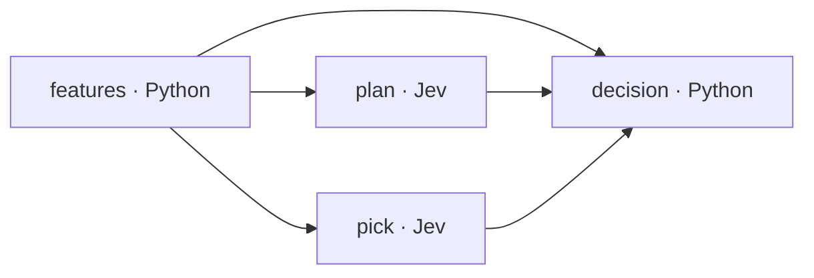

# An actual Jev call

This example is the `pick` node from turn 12 of the selected Pokémon harness. It is copied from a successful archived Jev request through Vercel AI Gateway. It was not generated as a documentation fixture.

Slowbro faces Gastrodon. The harness computes approximate damage races and switch risks from the player's available information, turns legal actions into textual criteria, and asks Jev to choose an action. Jev selects switching to Scizor. The final code accepts that recommendation, and the engine records the switch.

## Inspect it without making a request

```bash
python3 docs/examples/jev_call.py
```

The script checks the fixture's request and response digests and prints the archived answer. It uses only the standard library in this mode.

| File | Contents |
| --- | --- |
| [`pokemon-turn12-jev.json`](examples/pokemon-turn12-jev.json) | Complete state and question map, complete normalized answers, reported model/usage/rounding, and provenance |
| [`jev_call.py`](examples/jev_call.py) | Offline inspection by default; an explicit `--live` option |
| [`selected-pipeline.json`](../examples/pokemon/sample/selected-pipeline.json) | The unchanged selected harness, including Python sources and dynamic question construction |
| [`selected-pipeline.provenance.json`](../examples/pokemon/sample/selected-pipeline.provenance.json) | Original candidate identity, source archive digest, and exported file digest |

The complete request is deliberately kept in JSON rather than shortened inside a runnable snippet. The `state` contains the position, approximate knockout race, own team, revealed opponent team information, and recent log. The question contains an exact `instructions` string and a criterion for each eligible action.

## Send the same request again

```bash
uv sync --locked --extra dev
# Set AI_GATEWAY_API_KEY in your environment or your local .env.
uv run python docs/examples/jev_call.py --live
```

Equivalent application code, with the key already in the environment:

```python
import json
from pathlib import Path
from auto_jev.providers import JevClient

record = json.loads(Path("docs/examples/pokemon-turn12-jev.json").read_text())
request = record["request"]
result = JevClient(transport="vercel").judge(
    model=request["model"],
    state=request["state"],
    questions=request["questions"],
)
action = result["answers"]["action"]["choice"]
```

This is a fresh API call. The recorded model name is `typesafe-ai/jev`, an unpinned gateway alias; a new response is not promised to match the archive.

## What was actually returned

```json
{
  "type": "choice",
  "choice": "switch:2",
  "probabilities": {
    "move:3": 0.02,
    "move:4": 0.02,
    "move:2": 0.24,
    "switch:2": 0.72
  },
  "confidence": 0.64
}
```

| Action ID | Action | Recorded probability |
| --- | --- | --- |
| `switch:2` | Switch to Scizor | 72% |
| `move:2` | Psychic | 24% |
| `move:3` | Ice Beam | 2% |
| `move:4` | Slack Off | 2% |

The recorded request took approximately **259 ms** and reported 2,044 input tokens and 55 output tokens. That is one observed request, not a latency guarantee. Its `cache_hit` field is false.

These probabilities describe the action choice among the supplied options. They do not mean Scizor has a 72% chance of winning the battle, and the response's `confidence` is not an independently measured success rate.

## How the harness uses the answer

The selected flow has four actual execution nodes:



`features` builds the state and legal-action criteria. `plan` asks four tactical questions in one request. `pick` asks the action-choice question in a separate, parallel request. `decision` combines the results with code gates and can override a Jev recommendation. The visual feature cards in the website are subdivisions of these nodes, not extra API calls.

On turn 12 there is no code finisher override, the selected action passes the score gate, and the final output is `switch:2`. Scizor then takes Ice Beam and remains at 85% HP. The complete archived battle ends in a win on turn 15. This example establishes what this harness did; it does not establish that the Jev call was causally necessary for the win.

## Provenance and exactness

The source is run `20260921-012437-pokemon-mixed-expanded-405d85`, candidate `0617b0bb9505cddfc319231e6b2226924e1b1d40280b09486ee16d838342a502`, Eval episode `pokemon-expanded-validation-05`, decision index 12, request ID 13, node `pick`.

The original 3,621,150-byte trace has SHA-256 `9f52d96ac9717dca7a399de9ed4cc6f37018ef4c09bc01dcad5c8d9c459fb3ac`. The fixture records its JSON pointer and separate canonical digests for the extracted request and response. State, instructions, criteria, and answer values are copied unchanged. The response object is an explicit projection of the normalized `JevClient` response: local cache paths and gateway transport diagnostics are omitted, while the entire structured answer is retained. It is not presented as a byte-for-byte raw HTTP response.

Calculator estimates and their wording are also preserved. They can be imperfect, and the code may round HP differently from the public replay display. Editing those estimates would create a new example rather than preserve this request.

See the [TypeSafe primitive reference](https://docs.typesafe.ai/primitives) for the distinction between state, instructions, criteria, and structured answers. This repository's strict v3 question validator is narrower than the upstream API: instructions must be nonempty strings, and `noul` questions do not take criteria here.
